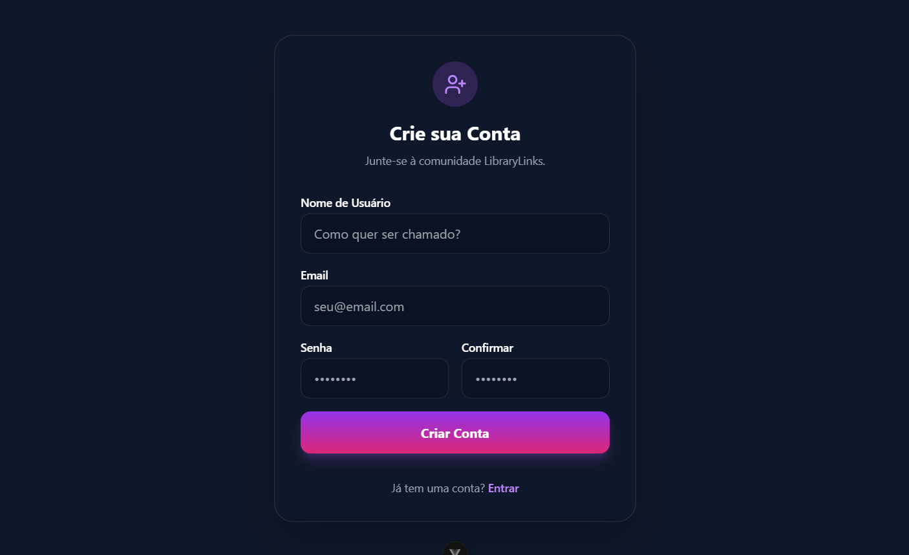
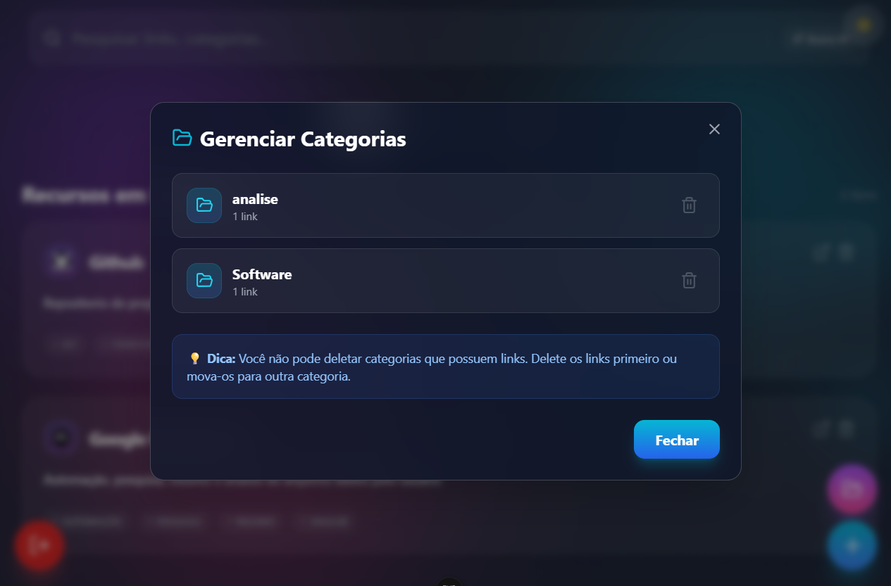
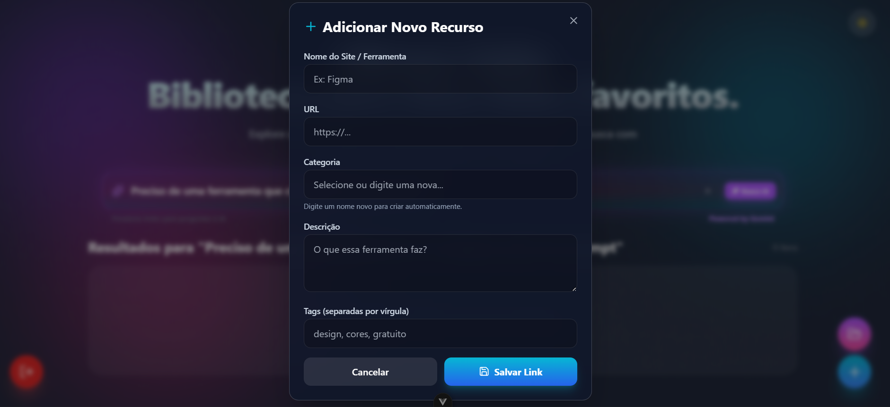

# LibraryLinks: Sua Biblioteca de Links para Desenvolvedores

O LibraryLinks é uma aplicação full-stack projetada para usuários que desejam uma maneira eficiente de organizar e acessar seus links mais importantes. Com ele, você pode salvar, categorizar e encontrar rapidamente as ferramentas que utiliza no seu dia a dia, eliminando a desordem de favoritos e abas perdidas.

## 🚀 Funcionalidades

-   **Autenticação de Usuários:** Sistema seguro de registro e login para garantir a privacidade dos seus links.
-   **CRUD Completo de Links:** Adicione, visualize e exclua links de forma simples e direta.
-   **Organização por Categorias:** Crie e delete categorias para manter seus links sempre organizados.
-   **Busca Inteligente:** Pesquise por links ou categorias e encontre o que precisa instantaneamente.
-   **Interface Moderna e Responsiva:** Uma experiência de usuário agradável e adaptada para qualquer tamanho de tela.

## 🖼️ Screenshots

| Página de Login                                     | Página de Registro                                      |
| ----------------------------------------- | --------------------------------------------- |
|     |     |

| Página do Gerenciador de Categorias                       | Modal de Adicionar um novo Link                           |
| ----------------------------------------------- | --------------------------------------------- |
|  |  |

## 💻 Tecnologias Utilizadas

O projeto é dividido em duas partes principais: o frontend e o backend.

-   **Frontend:**
    -   **Vue.js:** Framework progressivo para a criação de interfaces de usuário interativas e dinâmicas.
    -   **Vite:** Ferramenta de build de última geração que oferece um desenvolvimento frontend extremamente rápido.
    -   **Vue Router:** Biblioteca oficial para a criação de rotas e navegação na aplicação Vue.
    -   **Tailwind CSS:** Framework CSS utility-first que permite a criação de designs customizados de forma ágil e eficiente.

-   **Backend:**
    -   **Python:** Linguagem de programação robusta e versátil, utilizada como base para o backend.
    -   **FastAPI:** Framework de alta performance para a construção de APIs em Python, com validação de dados automática e documentação interativa.
    -   **SQLAlchemy:** ORM (Object-Relational Mapper) que facilita a comunicação entre o código Python e o banco de dados relacional.
    -   **JWT (JSON Web Tokens):** Padrão aberto para a criação de tokens de acesso que permitem uma autenticação segura e stateless.

## 🚀 Começando

Siga os passos abaixo para configurar e executar o projeto em seu ambiente local.

### ✅ Pré-requisitos

-   [Python 3.8+](https://www.python.org/downloads/)
-   [Node.js e npm](https://nodejs.org/en/)

### 📦 Backend

Primeiro, vamos configurar e executar a API.

```bash
# 1. Acesse o diretório do backend
cd backend

# 2. Crie e ative o ambiente virtual
# No Windows:
python -m venv .venv
.venv\\Scripts\\activate
# No macOS/Linux:
python3 -m venv .venv
source .venv/bin/activate

# 3. Instale as dependências do projeto
pip install -r requirements.txt

# 4. Inicie o servidor da API
python run.py
```

O backend estará disponível em `http://localhost:8000`.

### 🎨 Frontend

Agora, vamos configurar a interface do usuário.

```bash
# 1. Em um novo terminal, acesse o diretório do frontend
cd frontend

# 2. Instale as dependências do projeto
npm install

# 3. Inicie o servidor de desenvolvimento
npm run dev
```

A aplicação estará disponível em `http://localhost:5173` (ou em outra porta indicada pelo Vite).

---


## 👨‍💻 Autor

- **Douglas Araujo** - *Desenvolvedor Web Full Stack* - [LinkedIn](https://linkedin.com/in/douglas-araujo-dgprogdev)
- **Douglas Araujo** - *Desenvolvedor Web Full Stack* - [Portifolio](https://dgaraujo-dev.vercel.app/)


---
